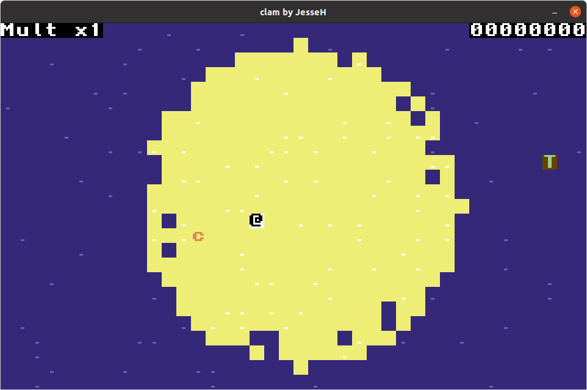

clam
===

A game with oldschool graphics about collecting clams written in Lua using [LÖVE](https://love2d.org/).

This game is also my entry for the [GDEX 2021 Game Jam](https://www.thegdex.com/gamejam) whose theme is `calm`.

# How to Play

## TL;DR

* Move around with `ASWD`
* Purchase items with `0-9`
* Get to the trophy (T) to win!

## Expanded

In *clam* you start out on an island surrounded by water. The goal of the game is to win by collecting the trophy which is placed outside of the island (T).

To progress in the game, you must collect clams (C). As you collect clams, your points go up and will reveal items that you can purchase which will show up at the bottom of the screen. You will need to press the appropriate button (0-9) to purchase the item.

In the top-left of the screen is your multiplier. This tells you how many points you collect per clam. In the top-right is your point counter.

# Story

Twenty years ago while exploring the beaches of an island, you discovered a box in the sand. As you dug it out you found the remains of what seemed to be a humanoid creature with small but distinctive horns.

Inside the box you also found a pearlescent clam that glowed in the dark. While holding the clam, others could hear the sounds of a storm and faint screams and cries for help. Holders would enter a trance that would distract them from everything else around them.

It was nearly impossible to get someone holding the clam to let it go or to do much else. Every night, the clam holder would disappear and later you discovered that they'd return after having gone and found fruit on the island for nourishment. A Holder could not take his eyes off the clam, it seemed. No one knew what it was like for the Holder because when the clam was finally ripped away from their hands they would not speak and seemed to not respond to anything said to them. They were lost.

You decided to let your companion, RXO-47, hold the clam because machine people were not affected by the clams mysterious powers. One day your curiosity got the better of you. While your crew was away you opened the container holding the clam and held it close to examine it.

Everything went dark. You woke up later, very hungry and alone on the island. Your crew, your companion and the clam was gone. Everything from your past began to fade from memory and you desired only one thing... The clam.

# How to run

1. Install [LÖVE](https://love2d.org/)
2. `git clone repo`
3. `cd repo/`
4. `love .`
